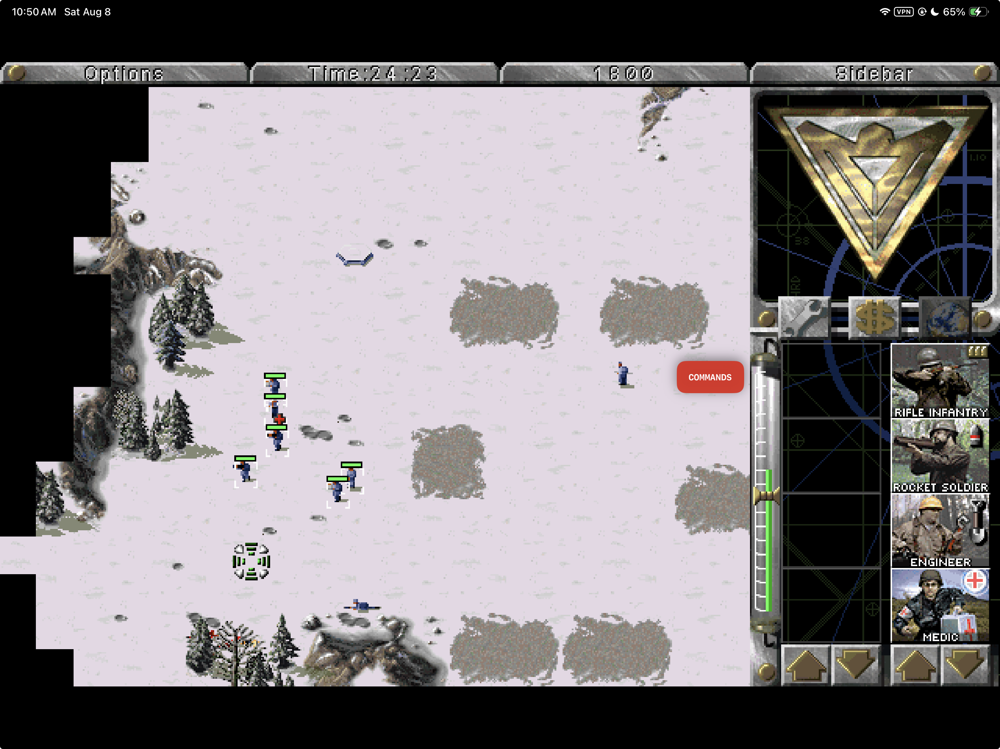

<p align="center">
  
</p>

<p align="center">
  
  <br>
  <sub>Current iPadOS gameplay using locally supplied Red Alert data. Game data is not included.</sub>
</p>

<h1 align="center">RAtouch</h1>

<p align="center">
  <strong>The original Red Alert simulation, given a touch-first iPad control system and a native Mac home.</strong>
</p>

<p align="center">
  <a href="https://github.com/chrissotraidis/ratouch/actions/workflows/ratouch.yml"></a>
  
  
  
  <a href="License.txt"></a>
</p>

<p align="center">
  <a href="#why-ratouch-exists">Purpose</a> ·
  <a href="#ratouch-and-openra">RAtouch and OpenRA</a> ·
  <a href="#touch-is-the-product">Touch controls</a> ·
  <a href="#install-status">Install status</a> ·
  <a href="docs/remaining-work.md">Remaining work</a> ·
  <a href="#install-and-run">Build</a> ·
  <a href="#bring-your-own-data">Game data</a> ·
  <a href="docs/engineering-record-2026-07-21.md">Build record</a> ·
  <a href="#contributing">Contributing</a>
</p>

RAtouch is an Apple-platform port of the original Red Alert engine with one central goal: make a keyboard-and-mouse RTS genuinely playable by touch without redesigning the game underneath it.

Tap selects or orders. One finger drag-selects. Two fingers move the map. Pinch zooms the presentation. A hold becomes the original right-click. A slim native command deck supplies the keyboard actions and control groups an iPad otherwise lacks.

The campaigns, skirmish AI, movies, music, saves, production sidebar, hotkeys, and simulation rules remain engine-owned. RAtouch changes the platform and control layers around them.

> **Current availability:** source-build alpha for Apple-silicon macOS and the arm64 iPad Simulator. A signed Mac DMG and physical-iPad/TestFlight builds are planned, not yet published.

This repository contains engine, platform code, project artwork, and one reviewed gameplay capture. **It does not contain playable commercial game data.** You provide legally acquired compatible data on your own device.

## Install status

| Option | Status | What to do |
| --- | --- | --- |
| Source release candidate | **Ready on `main`** | The repository is still private; make it public only after the maintainer confirms the release decision. |
| macOS source build | **Verified on Apple silicon** | Build `RAtouch.app` locally with CMake and SDL2. |
| iPad Simulator source build | **Verified** | Build, install, and launch with the provided script and `simctl`. |
| Physical iPad build | **Not yet documented for public use** | Device signing and hardware acceptance remain release gates. |
| Downloadable `.ipa` | **Not published yet** | IPA packaging is the next separate milestone after this source-release pass. |
| TestFlight / App Store | **Not announced** | No public listing or TestFlight exists. |

The current source builds with networking disabled, passes all 26 automated tests, and passes the repository asset/link audit. Simulator and build evidence are not presented as physical-device certification.

## Why RAtouch exists

Running Red Alert on modern hardware is a solved problem. Making its original interaction model feel good on a sheet of glass is not.

The game assumes a precise pointer, two mouse buttons, keyboard modifiers, number groups, edge scrolling, and hotkeys that have no natural iPad equivalent. Simply turning every finger contact into a mouse click leaves selection, camera movement, right-click actions, queued orders, and recovery controls fighting one another.

RAtouch treats that as the product problem:

| Original assumption | RAtouch answer |
| --- | --- |
| Left mouse button | Tap to select, order, or use the original UI; drag one finger for anchored box selection |
| Right mouse button | Hold one finger for the original deselect/context path |
| Edge scroll and mouse wheel | Drag two fingers for proportional map movement; pinch for presentation zoom |
| Modifier keys | One-shot Attack+, Move+, Add+, and Queue+ commands |
| Number keys and Control-number | Native assign/recall control groups 1–0 |
| Desktop menus and loose files | Native Apple lifecycle, Files import, autosave, safe areas, pointer support, and accessibility metadata |

The result is not a mobile remake and not a layer of permanent virtual keyboard buttons. It is the original simulation with a deliberately translated control surface.

## RAtouch and OpenRA

[OpenRA](https://www.openra.net/about/) is a mature, cross-platform reimagining of classic RTS games. It modernizes the interface and gameplay with features such as attack-move, stances, fog of war, veterancy, revised production, multiplayer balance, replays, observers, and integrated online play.

RAtouch takes a different path.

RAtouch is a fork of [Vanilla Conquer](https://github.com/TheAssemblyArmada/Vanilla-Conquer), not a fork of OpenRA. That distinction matters: Vanilla Conquer aims to preserve the original executable behavior, while OpenRA explicitly evolves the rules and interface. Upstream Vanilla Conquer also still documents OpenAL as a macOS dependency and does not support repackaged Steam/Ultimate Collection data. [Apple deprecated OpenAL](https://developer.apple.com/videos/play/wwdc2019/508/) in macOS 10.15, so RAtouch replaces that dependency with one SDL2 mixer and adds a validated compatibility path for the known Steam 2229840 archive layout.

| | RAtouch | OpenRA |
| --- | --- | --- |
| Primary goal | Preserve the original Red Alert simulation while making it work naturally on Apple hardware—especially iPad | Rebuild and modernize classic RTS games for contemporary desktop play and multiplayer |
| Gameplay foundation | Vanilla Conquer and the original engine behavior | A separately developed engine with intentionally evolved rules and balance |
| Touch approach | Dedicated iPad app, gesture recognizer, presentation zoom, keyboard-free command deck, control groups, safe-area UI, lifecycle handling, and native Files flow | Some touch-accessible desktop UI, including a unit control bar; no official iPadOS or iOS release |
| macOS today | Verified source build; signed DMG is planned | Packaged, supported download available now |
| Online play | Disabled in the maintained Apple builds | Integrated online multiplayer and community maps/mods |

OpenRA is the better choice today if you want the easiest Mac installation, modern quality-of-life changes, or multiplayer. RAtouch is for players who want the original game behavior—or who want to play that original game directly on an iPad without pretending a finger is a mouse.

OpenRA's own project pages describe its gameplay as evolved from the classic releases, list official downloads for Windows, macOS, and Linux, and document a touch-accessible desktop control bar. See [About OpenRA](https://www.openra.net/about/), [official downloads](https://www.openra.net/download/), and its [touch-accessibility announcement](https://www.openra.net/news/10th-anniversary/).

## Touch is the product

<p align="center">
  
</p>

One finger owns the original left-button semantics. Two fingers own navigation. That separation is the core rule: selecting units should not also move the camera, and moving the camera should not accidentally issue orders.

The recognizer adds an intent dead zone before two-finger movement, samples both contacts before deciding between pan and pinch, rejects touches in presentation letterboxing, drains interrupted gestures cleanly, and keeps direct touch from triggering the original mouse-edge camera path. Pinch changes only presentation scale; it does not alter simulation scale.

The native command deck appears only during live gameplay. It exposes actions that are materially difficult without a keyboard, remembers its left/right position, stays clear of the original production sidebar, scales with Dynamic Type, and disappears while Options, confirmations, score screens, or the main menu own input. Armed one-shot commands cancel on settings, backgrounding, and other ownership changes instead of leaking into the next map tap.

The complete gesture state machine, overlay rules, hotkey coverage, and physical-device gates live in [the input and gameplay refinement contract](docs/input-design.md).

## Two Apple control models

<p align="center">
  
</p>

| | macOS | iPadOS |
| --- | --- | --- |
| Primary input | Mouse or trackpad + original hotkeys | Direct touch; hardware keyboard and pointer also supported |
| Selection | Click or pointer drag | Tap or one-finger drag |
| Map movement | Edge scroll, keys, pointer | Distance-proportional two-finger drag; direct touch never triggers edge scroll |
| Context / deselect | Right-click | Hold one finger |
| Display zoom | Native window and fullscreen controls | Pinch through fit, 1.5×, and 2×; double two-finger tap returns to fit |
| Keyboard actions | Original keyboard available | Native command deck, one-shot modifiers, and ten control-group slots |
| Game data | Native first-run picker into Application Support | Native Files picker into Application Support |
| Presentation | Resizable Retina-aware window and fullscreen | Fullscreen landscape with safe-area-aware overlays |

The simulation is shared. The control surface is designed for the device in front of it.

## Built, played, measured

| Native apps | Touch evidence | Runtime proof | Public boundary |
| --- | --- | --- | --- |
| Apple-silicon macOS app and arm64 iPad Simulator app | Tap, drag, hold, two-touch pinch/reset, command deck, control groups, pointer, and keyboard exercised in live missions | 26 automated tests plus documented Mac and iPad Simulator playtests | One reviewed gameplay capture; playable commercial data stays local and ignored |

The first end-to-end build was completed in a 20-hour proof-gated session: implementation, repeated campaign and skirmish play, input tuning, lifecycle checks, crash repair, documentation, and publication. Read the concise [engineering record](docs/engineering-record-2026-07-21.md) or the complete [runtime evidence log](docs/build-status.md).

## Availability and next step

| Platform | Available now | Public distribution target |
| --- | --- | --- |
| macOS | Verified Apple-silicon source build | Developer ID–signed and notarized DMG |
| iPadOS | Verified arm64 iPad Simulator source build | Physical-device beta, then TestFlight and an App Store attempt |
| iPhone | Not a supported product target | No commitment until an explicit interaction and UI-quality gate passes |

RAtouch is source-build alpha software prepared for public release. There is no downloadable DMG, IPA, or TestFlight build yet. The next milestone is to package and audit the `.ipa`; that work is deliberately not part of this repository-prep pass.

## Start here

1. [Build and launch](#install-and-run) the native app for macOS or the iPad Simulator.
2. On first launch, choose legally acquired compatible Red Alert data in the native picker.
3. Play with a mouse and the original hotkeys on Mac, or use the keyboard-free touch controls on iPad.

Your imported game files, settings, and saves remain local. RAtouch does not include advertising, analytics, tracking, or online multiplayer.

## Project status

RAtouch is an active alpha, not a packaged public release.

| Area | Current evidence |
| --- | --- |
| Gameplay | Intro, menus, Allied campaign, briefing, mission play, MCV deployment, two-stage structure production and placement, expansion menus, save/load, and lifecycle autosave exercised with legally supplied Steam 2229840 data |
| iPad input | Direct selection and orders, two-finger pan, pinch zoom, long-press right-click, control groups, keyboard-free commands, hardware keyboard, pointer, and touch settings exercised in Simulator |
| macOS input | Retina-aware absolute pointer synchronization, configurable 25–200% speed, edge scrolling, native window/fullscreen, menus, and clean quit autosave |
| Data safety | Native folder/file/ISO picker, structural validation, known-file hashes, atomic import, zero-copy Steam archive compatibility, provenance receipt, staged replacement, and save export |
| Audio and UI | One SDL2 game/movie mixer, underrun regression coverage, expansion-disc sound-bank reload, stable nested-MIX backing, focus-safe pause/resume, native command deck, Dynamic Type controls, display and volume settings, and bundled license views |
| Automated proof | 26 tests, arm64 iPad Simulator build, macOS build, and public-repository hygiene verification |

See the [20-hour engineering record](docs/engineering-record-2026-07-21.md), exact session evidence in [build status](docs/build-status.md), and the maintained [input contract](docs/input-design.md).

GitHub-hosted jobs are configured, but the latest runs were stopped before checkout because of an account billing/spending-limit restriction. The commands below are the same local gates used for the current passing result; hosted-runner status is not presented as source validation until those jobs can start.

### Verification queue

The authoritative open checklist is [Remaining work](docs/remaining-work.md).
The next locally executable case is `AUDIO-01`: complete a 30-minute
real-speaker session across music, EVA speech, construction, combat, Options,
hide/restore, and save/load.
The same document separates later gameplay, real-file import, physical-device,
packaging, and human-owned release gates so Simulator proof is never mistaken
for device or distribution sign-off.

Simulator evidence is reported as Simulator evidence; it is not presented as physical-device certification.

### Major audio repair

The July 28 repair addressed two separate audio failure paths. SDL streaming now tolerates a one-callback refill gap instead of ending a sample immediately. Expansion switching now prioritizes the selected disc, stops the active primary sound buffer, reloads and caches that disc's `SOUNDS.MIX`, preserves nested MIX files against later search-path changes, and resumes the active theme. The `soundio_sdl2`, `cdfile_search`, and `mix_backing` regressions cover those code paths.

This is strong build and automated evidence, not a claim that every speaker, headphone, Bluetooth, interruption, or long-session case has passed. The real-speaker soak remains in [Remaining work](docs/remaining-work.md).

## Install and run

### Requirements

- A Mac with Apple silicon. This is the configuration currently verified.
- macOS: [Homebrew](https://brew.sh), CMake, and SDL2.
- iPad Simulator: full Xcode with an iPadOS Simulator runtime. The build targets iPadOS 15.0 or newer.
- Legally acquired compatible Red Alert data. No commercial data is downloaded by the build.

### macOS

Build the focused Apple target, run its tests, and open the app:

```sh
brew install cmake sdl2

cmake -S . -B build/ratouch-macos \
  -DBUILD_VANILLATD=OFF \
  -DBUILD_VANILLARA=ON \
  -DBUILD_TESTS=ON \
  -DSDL_AUDIO=ON \
  -DOPENAL=OFF \
  -DNETWORKING=OFF

cmake --build build/ratouch-macos --parallel
ctest --test-dir build/ratouch-macos --output-on-failure
python3 scripts/verify-public-repo.py
open build/ratouch-macos/RAtouch.app
```

For the repeatable gameplay-focused regression and live scenario sequence, see
the [gameplay compatibility loop](docs/gameplay-compatibility.md):

```sh
./scripts/run-gameplay-loop.sh quick
```

The app is produced at `build/ratouch-macos/RAtouch.app` and stores imported data, settings, and saves under `~/Library/Application Support/Ratouch/vanillara`. On a clean launch, its native picker accepts legally acquired MIX files, an ISO, or a folder and installs validated data through the same transactional importer used on iPadOS.

### iPad Simulator

Open Simulator and boot an iPad, then build, install, and launch RAtouch:

```sh
open -a Simulator
./scripts/build-ios-simulator.sh
xcrun simctl install booted build/ios-simulator/Debug/vanillara.app
xcrun simctl launch booted com.chrissotraidis.ratouch
```

The build script also prints the generated `.app` path. On first launch, choose legally acquired MIX files, a folder containing them, or a supported ISO in the native setup screen. Nothing is copied into the app bundle at build time.

Installing on a physical iPad currently requires an Apple development-signing workflow that is not yet packaged or documented as a supported release path.

## Bring your own data

RAtouch intentionally ships empty. Imported files stay in the app's Application Support container and are excluded from source, CI, and release artifacts. Known Steam 2229840 files are accepted only when filename, byte size, and SHA-256 agree; unknown structurally valid archives remain identifiable as user-supplied data rather than being silently misclassified.

- [Asset provenance and deterministic mapping](docs/asset-provenance.md)
- [Save compatibility contract](docs/save-compatibility.md)
- [Local `ref/` policy](ref/README.md)
- [Product requirements and phased build plan](docs/prd-build-plan.md)
- [Technical and legal feasibility report](docs/feasibility-report.md)

Never commit MIX files, ISO images, save files, or imported artwork. New gameplay screenshots require explicit maintainer review and must not expose personal data; the single README capture is the reviewed public exception.

## Privacy

The maintained Apple builds compile with networking disabled. The iPad privacy manifest declares no tracking, collected data, tracking domains, or required-reason API use. Imported game files, settings, provenance, and saves stay in local Application Support unless you explicitly export a save through Files.

The source link in the About view is the only web destination exposed by the app; opening it is an explicit user action.

## Contributing

Issues and focused pull requests are welcome, especially for reproducible input bugs, Apple-platform build fixes, accessibility, and tests. Before opening a change:

1. keep engine changes narrow and platform behavior isolated;
2. run the macOS tests and `python3 scripts/verify-public-repo.py`;
3. describe whether input evidence came from Simulator or physical hardware;
4. do not attach game archives, saves, or unreviewed gameplay captures.

Read [Contributing](CONTRIBUTING.md) before proposing a change. Start with [Remaining work](docs/remaining-work.md), the [input contract](docs/input-design.md), and [build status](docs/build-status.md). Security-sensitive reports should avoid including game data or personal save files.

### Repository guide

| Path | Purpose |
| --- | --- |
| `apple/ios/` | Native iPad setup, command deck, control groups, settings, lifecycle, and app metadata |
| `apple/macos/` | Native Mac menus, settings, data management, and app metadata |
| `apple/shared/` | Transactional importer, manifest, MIX validation, and ISO support shared by both apps |
| `common/wwtouch.*` | Platform-neutral gesture recognizer and touch action model |
| `tests/` | Gesture, geometry, lifecycle, settings, importer, audio, save, and regression coverage |
| `docs/` | Product contract, engineering record, current technical evidence, reviewed public images, provenance, and compatibility notes |
| `ref/` | Local-only game-data workspace; everything except its policy files is ignored |

## Direction

The next refinements are proof-gated:

1. play on physical iPads and tune drag thresholds, pan direction, hold timing, Pencil, trackpad, haptics, accessibility, thermals, and audio interruption;
2. keep running campaign and skirmish sessions around selection, orders, scrolling, zoom, command-deck recovery, control groups, save/load, and lifecycle;
3. package the verified Mac build as a signed and notarized DMG with a clean first-run data-import experience;
4. establish signed iPad device builds, then move through a focused beta and TestFlight before attempting App Store distribution;
5. preserve reproducible tests, honest platform labels, and a public repository free of playable commercial data.

The live open queue is in [Remaining work](docs/remaining-work.md). The original
product sequence and acceptance rationale remain in the
[PRD and build plan](docs/prd-build-plan.md).

## Foundation and license

RAtouch is built on [Vanilla Conquer](https://github.com/TheAssemblyArmada/Vanilla-Conquer) and keeps its portable engine architecture intact wherever possible. The source is licensed under GPL-3.0 with the additional terms carried in [License.txt](License.txt). Those terms grant no trademark or game-asset rights; see the scoped [rights and licensing boundary](RIGHTS_AND_LICENSES.md). The complete license text and source link are also available inside each build through **RAtouch → About RAtouch** on macOS and **Commands → Controls → About & license** on iPadOS.

RAtouch is an independent, non-commercial project. It is not affiliated with, endorsed by, or supported by Electronic Arts. Product names may be referenced only to explain compatibility with data the user already owns.

The gameplay image at the top was supplied for this project and shows the app running with locally provided game data. It is documentation, not a redistribution of the game or a grant of rights in Electronic Arts material.
