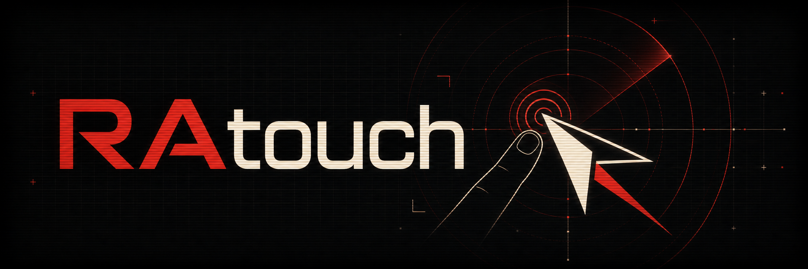
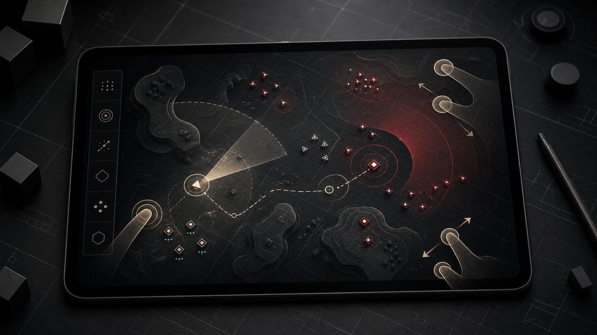
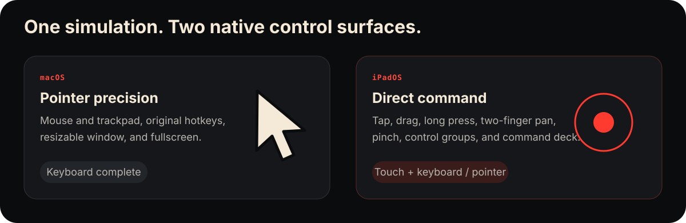
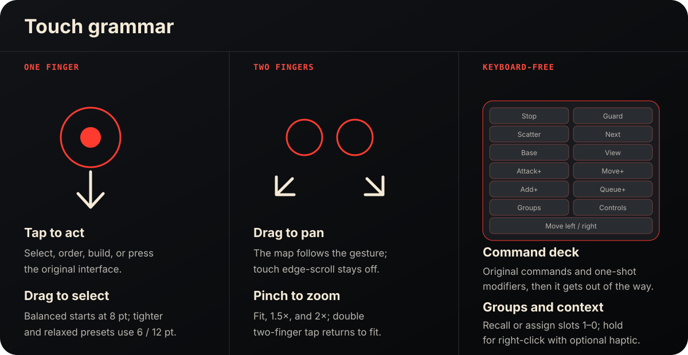

<p align="center">
  
</p>

<p align="center">
  <strong>The original 1996 real-time strategy simulation, rebuilt for the way Macs and iPads are actually used.</strong>
</p>

<p align="center">
  <a href="https://github.com/chrissotraidis/ratouch/actions/workflows/ratouch.yml"></a>
  
  
  <a href="License.txt"></a>
</p>

<p align="center">
  <a href="#install-and-run">Install</a> ·
  <a href="#native-where-it-matters">Platforms</a> ·
  <a href="#touch-controls">Touch controls</a> ·
  <a href="#bring-your-own-data">Game data</a> ·
  <a href="#project-status">Status</a> ·
  <a href="#contributing">Contributing</a>
</p>

RAtouch preserves the campaigns, skirmish AI, movies, music, saves, build queues, and rules of the original game. It changes the platform layer around them: native Apple builds, sandbox-safe data import, lifecycle handling, modern audio, precise pointer input on Mac, and a deliberate touch grammar on iPad.

This repository contains engine and platform code only. **It does not contain commercial game data.** You provide legally acquired compatible data on your own device.

<p align="center">
  
  <br>
  <sub>Original RAtouch concept art — not a game screenshot and not built from commercial assets.</sub>
</p>

## Start here

RAtouch is source-build alpha software. There is no downloadable release or TestFlight build yet.

1. [Build and launch](#install-and-run) the native app for macOS or the iPad Simulator.
2. On first launch, choose legally acquired compatible Red Alert data in the native picker.
3. Play with a mouse and the original hotkeys on Mac, or use the keyboard-free touch controls on iPad.

Your imported game files, settings, and saves remain local. RAtouch does not include advertising, analytics, tracking, or online multiplayer.

## Native where it matters

<p align="center">
  
</p>

| | macOS | iPadOS |
| --- | --- | --- |
| Primary input | Mouse or trackpad + original hotkeys | Direct touch; hardware keyboard and pointer supported |
| Selection | Click or pointer drag | Tap or one-finger drag |
| Map movement | Edge scroll, keys, pointer | Distance-proportional two-finger drag after an intent dead zone; direct touch never triggers edge scroll |
| Context / deselect | Right-click | Long press |
| Display zoom | Window and presentation controls | Pinch through fit, 1.5×, and 2×; double two-finger tap returns to fit |
| Missing keyboard actions | Full keyboard available | Accessible command palette, one-shot Attack+, Move+, Add+, and Queue+ modifiers, ten assignable control-group slots, and an in-game Controls sheet |
| Game data | Native first-run picker into Application Support | Native Files picker into Application Support |
| Window model | Resizable native window, macOS menus, and fullscreen toggle | Fullscreen landscape in v1 |

The simulation is shared. The control surface is not forced to pretend that a finger is a mouse.

## Touch controls

<p align="center">
  
</p>

One finger keeps Red Alert's original left-button semantics: tap to select or order, drag to box-select. Two fingers own map movement and zoom, with an intent dead zone that prevents hand jitter from becoming camera motion. Long press supplies right-click. A real mouse or trackpad immediately restores pointer behavior and edge scrolling.

The slim native command tab supplies the actions an iPad keyboard does not: one-shot Attack+, Move+, Add+, and Queue+ modifiers; groups 1–0; save/load; and a complete Controls sheet. It can sit on either safe-area edge for handedness, stays clear of the game sidebar, scales with Dynamic Type, and lets touches outside its controls pass through to the battlefield.

The complete hotkey coverage matrix, overlay rules, and repeatable playtest loop live in [the input and gameplay refinement contract](docs/input-design.md).

## Project status

RAtouch is an active alpha, not a packaged public release.

| Area | Current evidence |
| --- | --- |
| Gameplay | Intro, menus, Allied campaign, briefing, mission play, skirmish, expansion menus, save/load, and lifecycle autosave exercised with legally supplied Steam 2229840 data |
| iPad input | Direct selection and orders, two-finger pan, pinch zoom, long-press right-click, control groups, keyboard-free commands, hardware keyboard, pointer, and touch settings exercised in Simulator |
| macOS input | Retina-aware pointer mapping, aligned clicks and software cursor, configurable 25–200% speed, edge scrolling, native window/fullscreen, menus, and clean quit autosave |
| Data safety | Native folder/file/ISO picker, structural validation, known-file hashes, atomic import, provenance receipt, staged replacement, and save export |
| Audio and UI | SDL2 game/movie audio, native command deck, Dynamic Type controls, display and volume settings, and bundled license views |
| Automated proof | 23 tests, arm64 iPad Simulator build, macOS build, and public-repository hygiene verification |

See the exact session evidence and remaining hardware/release gates in [build status](docs/build-status.md).

### Still to verify

- Physical iPad feel: sustained multitouch, Pencil, trackpad, haptics, accessibility, thermals, and audio interruption.
- Signed device builds, TestFlight, App Store packaging, and release compliance.
- Intel Mac or universal-binary packaging, signing, and notarization.
- Real-file validation for every declared non-Steam import layout.

Simulator evidence is reported as Simulator evidence; it is not presented as physical-device certification.

## Install and run

### Requirements

- A Mac with Apple silicon. This is the configuration currently verified.
- macOS: [Homebrew](https://brew.sh), CMake, and SDL2.
- iPad Simulator: full Xcode with an iPadOS Simulator runtime. The build targets iPadOS 15.0 or newer.
- Legally acquired compatible Red Alert data. No commercial data is downloaded by the build.

### macOS

Build the focused Apple target, run its tests, and open the app:

```sh
brew install cmake sdl2

cmake -S . -B build/ratouch-macos \
  -DBUILD_VANILLATD=OFF \
  -DBUILD_VANILLARA=ON \
  -DBUILD_TESTS=ON \
  -DSDL_AUDIO=ON \
  -DOPENAL=OFF \
  -DNETWORKING=OFF

cmake --build build/ratouch-macos --parallel
ctest --test-dir build/ratouch-macos --output-on-failure
python3 scripts/verify-public-repo.py
open build/ratouch-macos/RAtouch.app
```

The app is produced at `build/ratouch-macos/RAtouch.app` and stores imported data, settings, and saves under `~/Library/Application Support/Ratouch/vanillara`. On a clean launch, its native picker accepts legally acquired MIX files, an ISO, or a folder and installs validated data through the same transactional importer used on iPadOS.

### iPad Simulator

Open Simulator and boot an iPad, then build, install, and launch RAtouch:

```sh
open -a Simulator
./scripts/build-ios-simulator.sh
xcrun simctl install booted build/ios-simulator/Debug/vanillara.app
xcrun simctl launch booted com.chrissotraidis.ratouch
```

The build script also prints the generated `.app` path. On first launch, choose legally acquired MIX files, a folder containing them, or a supported ISO in the native setup screen. Nothing is copied into the app bundle at build time.

Installing on a physical iPad currently requires an Apple development-signing workflow that is not yet packaged or documented as a supported release path.

## Bring your own data

RAtouch intentionally ships empty. Imported files stay in the app's Application Support container and are excluded from source, CI, and release artifacts. Known Steam 2229840 files are accepted only when filename, byte size, and SHA-256 agree; unknown structurally valid archives remain identifiable as user-supplied data rather than being silently misclassified.

- [Asset provenance and deterministic mapping](docs/asset-provenance.md)
- [Save compatibility contract](docs/save-compatibility.md)
- [Local `ref/` policy](ref/README.md)
- [Product requirements and phased build plan](docs/prd-build-plan.md)
- [Technical and legal feasibility report](docs/feasibility-report.md)

Never commit MIX files, ISO images, save files, imported artwork, or screenshots containing commercial game assets.

## Privacy

The maintained Apple builds compile with networking disabled. The iPad privacy manifest declares no tracking, collected data, tracking domains, or required-reason API use. Imported game files, settings, provenance, and saves stay in local Application Support unless you explicitly export a save through Files.

The source link in the About view is the only web destination exposed by the app; opening it is an explicit user action.

## Contributing

Issues and focused pull requests are welcome, especially for reproducible input bugs, Apple-platform build fixes, accessibility, and tests. Before opening a change:

1. keep engine changes narrow and platform behavior isolated;
2. run the macOS tests and `python3 scripts/verify-public-repo.py`;
3. describe whether input evidence came from Simulator or physical hardware;
4. do not attach or commit commercial game assets, derived screenshots, archives, or saves.

Start with the [input contract](docs/input-design.md), [build status](docs/build-status.md), and [PRD/build plan](docs/prd-build-plan.md). Security-sensitive reports should avoid including game data or personal save files.

## Direction

The next refinements are proof-gated:

1. repeat campaign and skirmish playtests around selection, orders, scrolling, zoom, sidebar recovery, save/load, and lifecycle;
2. tune gesture thresholds and pan direction on physical iPads, then verify Pencil, trackpad feel, haptics, accessibility, thermals, and audio interruption;
3. keep refining the proven one-shot modifiers and control-group workflow from real campaign and skirmish sessions;
4. refine native Mac settings, packaging, signing, notarization, and release compliance now that live in-mission quit autosave is proven;
5. keep the public README visual, current, reproducible, and free of commercial assets.

The full sequence and acceptance gates are in the [PRD and build plan](docs/prd-build-plan.md).

## Foundation and license

RAtouch is built on [Vanilla Conquer](https://github.com/TheAssemblyArmada/Vanilla-Conquer) and keeps its portable engine architecture intact wherever possible. The source is licensed under GPL-3.0 with the additional terms carried in [License.txt](License.txt). Those terms grant no trademark or game-asset rights. The complete text and source link are also available inside each build through **RAtouch → About RAtouch** on macOS and **Commands → Controls → About & license** on iPadOS.

RAtouch is an independent, non-commercial project. It is not affiliated with, endorsed by, or supported by Electronic Arts. Product names may be referenced only to explain compatibility with data the user already owns.
